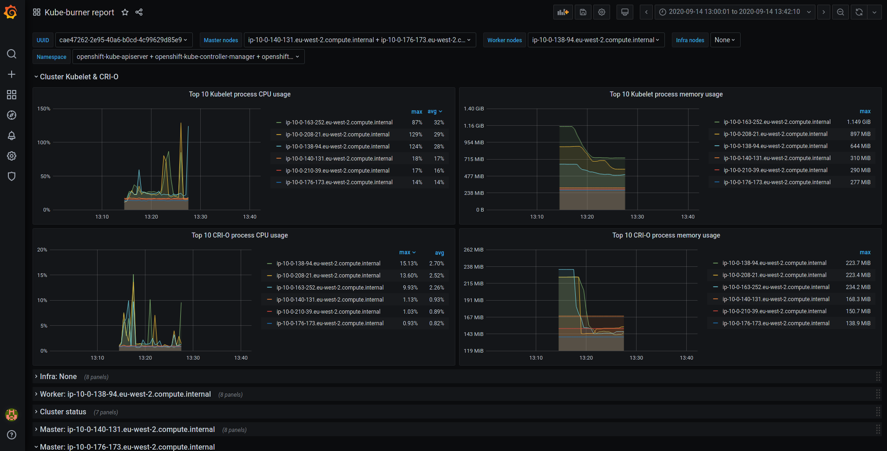

# kube-burner dashboard

To get a kube-burner report in form of grafana dashboard just execute the script dashboard.sh with the ES datasource used to index the metrics as shown below:

```console
$ ./dashboard.sh -e http://elastic-elk.apps.rsevilla-ocp45-ovn.perf-testing.devcluster.openshift.com
cbe56eb24853da9be8b674f3cc4bb3c57babaaa26e4579cab11c0317af8701f6
Adding dashboard kube-burner.json
Kube-burner dashboard available at:
http://localhost:30293/d/hIBqKNvMz/kube-burner-report?from=now-3h&to=now
```



## Available dashboards

Each of the grafana dashboards available here is bound to a specific metric profile, avaialable in the [metric-profiles directory](../metric-profiles) of this repository.

-  *api-and-etcd.json*: Bound to the `etcdapi.yml` profile
-  *kube-burner-aggregated-latest.json*: Bound to the `metrics-aggregated.yaml` profile
-  *kube-burner-latest.json*: Bound to the `metrics.yaml` profile
-  *monitoring-sizing.json*: Bound to the `monitoring-metrics.yaml` profile
